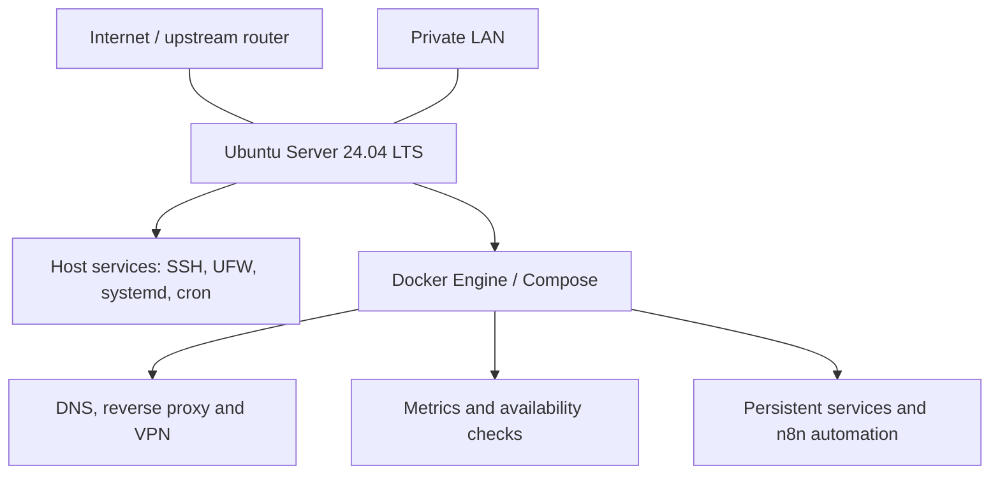

# Linux Homelab

**Linux Infrastructure & Self-Hosted Homelab**

I operate a personal Ubuntu Server running Docker / Compose services, with
intentional network separation, VPN remote access, host metrics and service
availability monitoring. Daily backups, automated verification and n8n
notifications support routine maintenance and troubleshooting.

This repository documents the live environment and the engineering decisions
behind it, with examples of monitoring and operational workflow executions.

## Architecture

A single host runs service-oriented Docker networks, with selected containers
using host networking. The diagram shows component relationships, not public
reachability. See the [architecture overview](docs/architecture.md).

## Technical Focus

| Area | Practical implementation |
| --- | --- |
| Linux | Ubuntu Server, systemd, SSH, cron, unattended upgrades and time synchronization |
| Containerization | Docker Engine, Compose projects, bridge/host networking and persistent mounts |
| Networking | AdGuard Home DNS, Nginx Proxy Manager, WireGuard / wg-easy, OpenVPN and UFW |
| Observability | Host metrics validated through node-exporter → Prometheus → Grafana; container metrics and availability checks |
| Security | Effective SSH restrictions, firewall policy, Lynis, rkhunter and security notifications |
| Backup & recovery | Automated daily archives, local/USB copies, integrity verification and extraction-based restore simulation |
| Automation | cron scheduling, n8n status classification and Telegram notifications |

## Current Environment

- Ubuntu Server 24.04 LTS with Docker Engine and Docker Compose.
- Approximately **17 containers across 13 Compose projects**.
- Multiple Docker bridge networks plus selected host-network services.
- DNS, reverse proxy and VPN services.
- Host metrics in Grafana and multiple availability checks in Uptime Kuma.
- Daily backup at **04:00** and automated verification at **05:00**, server-local time.
- Three local backup destinations: one local directory and two USB targets.

## Key Engineering Practices

- **Service-oriented network separation:** distinct reverse proxy, database and
  monitoring networks; intentional multi-network connectivity for n8n.
- **Explicit persistence boundary:** most important state is bind-mounted below
  `~/homelab/` and covered by the directory archive.
- **Layered access design:** DNS, reverse proxy and VPN roles are documented
  alongside the interaction between UFW, Docker publishing and upstream NAT.
- **Complementary monitoring:** host/container metrics and availability checks
  support troubleshooting from different perspectives.
- **Backup verification:** archive integrity, temporary extraction, expected
  structure and cross-copy hashes are checked automatically.
- **Operational feedback:** security and backup results feed n8n and Telegram.

Examples: [host metrics and availability monitoring](docs/observability.md)
and [backup/security workflow executions](docs/operations.md).

## Documentation

| Document | Covers |
| --- | --- |
| [Architecture](docs/architecture.md) | Infrastructure layers, design decisions and scope |
| [Host platform](docs/host-platform.md) | Linux services, administration and maintenance |
| [Container platform](docs/container-platform.md) | Inventory, Docker networks and persistence |
| [Networking](docs/networking.md) | DNS, proxy, VPN, firewall and exposure boundaries |
| [Observability](docs/observability.md) | Metrics flow, dashboards and availability checks |
| [Security](docs/security.md) | Effective SSH settings and security control status |
| [Backup and recovery](docs/backup-and-recovery.md) | Scheduling, copies, verification and recovery limits |
| [Operations](docs/operations.md) | Automation, notifications and troubleshooting |

Diagrams: [architecture](diagrams/architecture.md),
[Docker networks](diagrams/docker-networks.md),
[observability](diagrams/observability-flow.md),
[backup flow](diagrams/backup-flow.md).

## Repository Scope

This repository documents a live personal homelab; it does not deploy it.
Complete deployment configurations, credentials and personal service data are
excluded. Host names, paths and storage targets are generalized for public reading.
