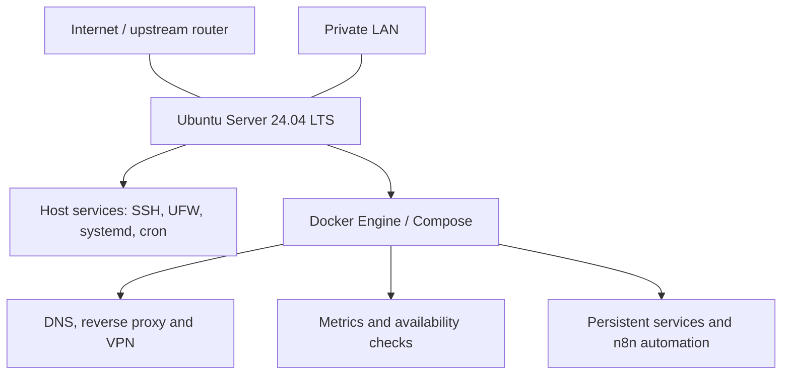

# Linux Homelab

**Linux Infrastructure & Self-Hosted Homelab** — a practical personal environment
built around Ubuntu Server, Docker and operational automation. This repository
documents the live architecture and engineering decisions behind networking,
monitoring, security and backup workflows.

The focus is infrastructure administration and reliability practices. Hosted
applications provide workloads for that infrastructure rather than define the
project.

## Architecture

A single host runs service-oriented Docker networks, with selected containers
using host networking. The diagram shows component relationships, not public
reachability. See the [architecture overview](docs/architecture.md).

## Technical Focus

| Area | Practical implementation |
| --- | --- |
| Linux | Ubuntu Server, systemd, SSH, cron, unattended upgrades and time synchronization |
| Containerization | Docker Engine, Compose projects, bridge/host networking and persistent mounts |
| Networking | AdGuard Home DNS, Nginx Proxy Manager, WireGuard / wg-easy, OpenVPN and UFW |
| Observability | Prometheus, node-exporter, cAdvisor, Grafana, Netdata and Uptime Kuma |
| Security | Effective SSH restrictions, firewall policy, Lynis, rkhunter and security notifications |
| Backup & recovery | Daily filesystem archives, local/USB copies, retention and automated extraction tests |
| Automation | cron scheduling, n8n status classification and Telegram notifications |

## Infrastructure Snapshot

- Ubuntu Server 24.04 LTS with Docker Engine and Docker Compose.
- Approximately **17 containers across 13 Compose projects**.
- Multiple Docker bridge networks plus selected host-network services.
- DNS, reverse proxy and VPN services.
- Host/container metrics, visualization and service availability tooling.
- Daily backup at **04:00** and automated verification at **05:00**, server-local time.
- Three local backup destinations: one local directory and two USB targets.

Counts and configuration reflect the supplied verified snapshot; they are not a
claim that every service, check or notification is currently healthy.

## Key Engineering Practices

- **Service-oriented network separation:** distinct reverse proxy, database and
  monitoring networks; intentional multi-network connectivity for n8n.
- **Explicit persistence boundary:** most important state is bind-mounted below
  `~/homelab/` and covered by the directory archive.
- **Layered access design:** DNS, reverse proxy and VPN roles are documented
  alongside the interaction between UFW, Docker publishing and upstream NAT.
- **Complementary monitoring:** host/container metrics and availability checks
  support troubleshooting from different perspectives.
- **Backup verification:** archive integrity, temporary extraction, expected
  structure and cross-copy hashes are checked automatically.
- **Operational feedback:** security and backup results feed n8n and Telegram.

Important boundaries remain explicit: backup copies are local; live PostgreSQL
files are not a database-consistent backup; Prometheus/Netdata named-volume
history is outside the archive. SSH password authentication is enabled, and
CrowdSec active enforcement is not currently treated as verified.

## Documentation

| Document | Covers |
| --- | --- |
| [Architecture](docs/architecture.md) | Infrastructure layers, decisions and evidence scope |
| [Host platform](docs/host-platform.md) | Linux services, administration and maintenance |
| [Container platform](docs/container-platform.md) | Inventory, Docker networks and persistence |
| [Networking](docs/networking.md) | DNS, proxy, VPN, firewall and exposure boundaries |
| [Observability](docs/observability.md) | Monitoring roles, storage and verification limits |
| [Security](docs/security.md) | Effective SSH settings and security control status |
| [Backup and recovery](docs/backup-and-recovery.md) | Scheduling, copies, verification and recovery limits |
| [Operations](docs/operations.md) | Automation, notifications and troubleshooting |

Diagrams: [architecture](diagrams/architecture.md),
[Docker networks](diagrams/docker-networks.md),
[observability](diagrams/observability-flow.md),
[backup flow](diagrams/backup-flow.md).

## Repository Scope

This is technical documentation for a live personal homelab, intended to support
CV discussions and infrastructure interviews. It contains no complete deployment
configurations, provisioning automation, credentials or personal service data.
Host names, paths and storage targets are generalized for public reading.
