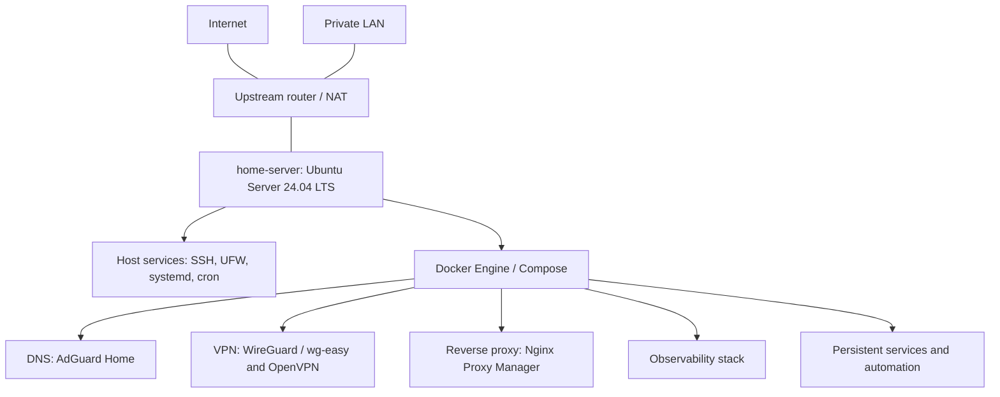

# High-Level Architecture

Connections represent architecture, not a map of externally reachable ports.
Actual Internet exposure depends on upstream router/NAT configuration and
host/container networking. DNS and VPN services also run as containers.

See [architecture](../docs/architecture.md) and [networking](../docs/networking.md).
