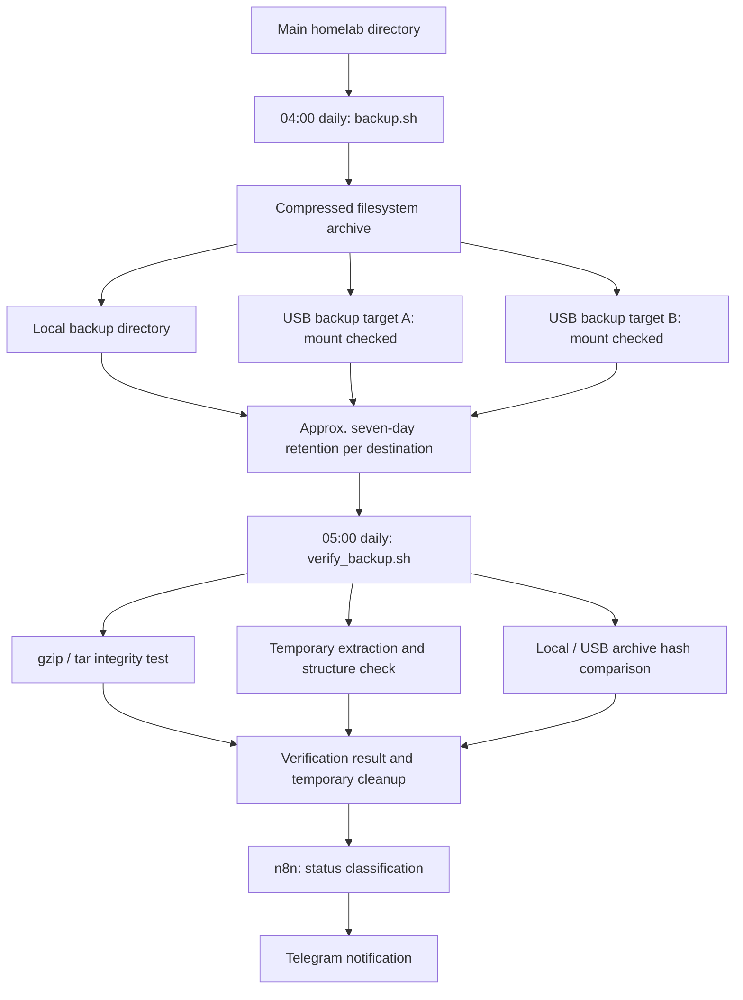

# Backup and Verification Flow

The schedule is server-local time. Retention is a destination policy; verification
selects the latest archive. Copies remain local. Verification includes an
extraction-based restore simulation; application recovery is a separate step.

See [backup and recovery](../docs/backup-and-recovery.md).
