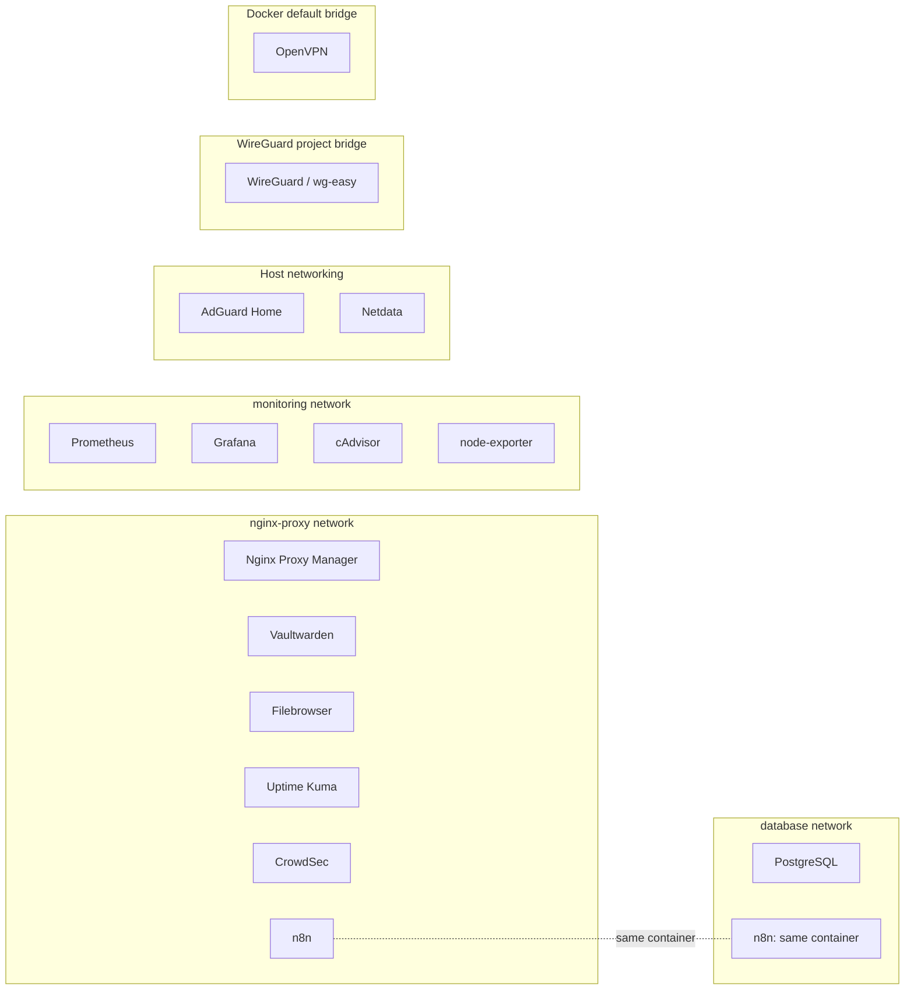

# Docker Networks

Boxes show network membership.
n8n deliberately joins multiple networks to reach infrastructure components;
its two labels represent one container. Other projects have their own networks.

See [container platform](../docs/container-platform.md) and
[networking](../docs/networking.md).
