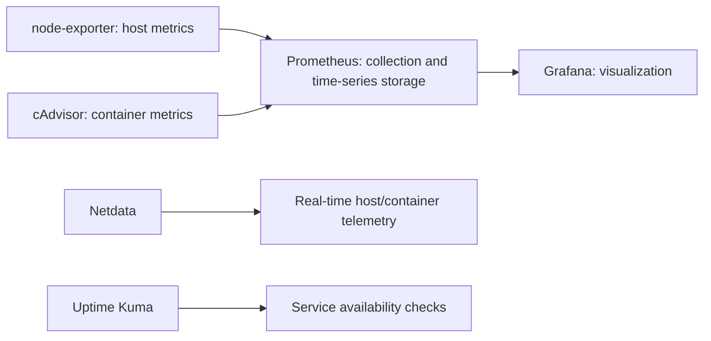

# Observability Flow

This shows the monitoring architecture and component roles. It does not certify
the health of every scrape target, dashboard, availability check or alert.

See [observability](../docs/observability.md).
