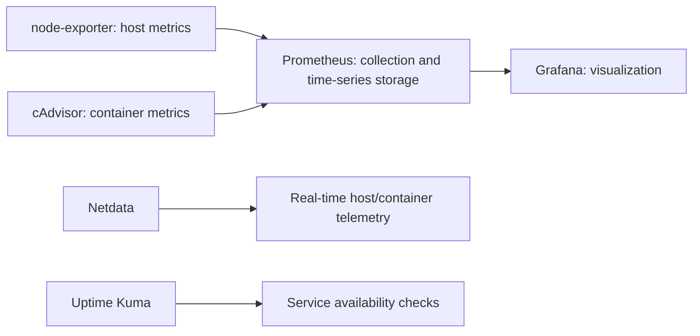

# Observability Flow

The node-exporter → Prometheus → Grafana path is validated with host metrics.
Uptime Kuma is actively used for availability checks.

See [observability](../docs/observability.md) for the dashboards and storage boundary.
