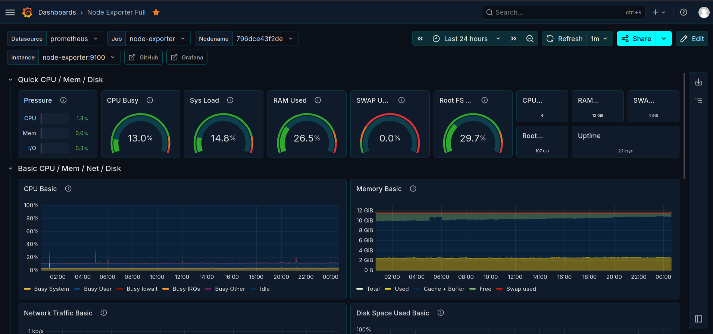
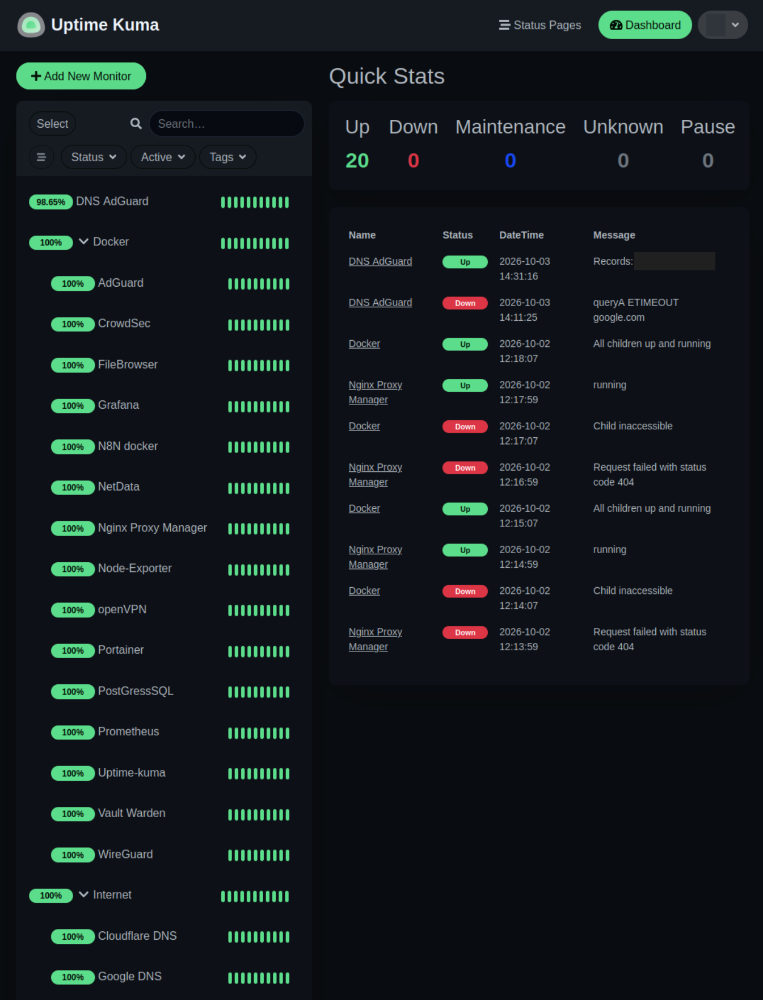

# Observability

Prometheus collects host metrics from node-exporter and container metrics from
cAdvisor, with Grafana for visualization. Netdata provides real-time telemetry,
and Uptime Kuma is actively used for service availability monitoring.

## Component Roles

| Component | Role |
| --- | --- |
| node-exporter | Host metrics |
| cAdvisor | Container metrics |
| Prometheus | Metric collection and time-series storage |
| Grafana | Metric visualization |
| Netdata | Real-time host/container telemetry |
| Uptime Kuma | Service availability checks |

See the [observability flow](../diagrams/observability-flow.md).

## Host Metrics in Grafana

The **node-exporter → Prometheus → Grafana** path has been operationally
validated with live/recorded host metrics: CPU, system load, RAM, swap,
filesystem usage, network activity and uptime.

*The Node Exporter Full dashboard uses the Prometheus datasource and shows
host resource gauges and recorded CPU/memory trends.*

## Availability Checks

*Multiple DNS and service checks are configured, with status indicators and
Up/Down event history. The DNS response address and profile initial are redacted.*

The displayed percentages describe the checks' selected reporting periods, not
an uptime guarantee. A container availability check, including CrowdSec's, does
not validate the application's enforcement behavior.

## Connectivity and Storage

Prometheus, Grafana, cAdvisor and node-exporter belong to the `monitoring`
network. Netdata uses host networking; Uptime Kuma belongs to `nginx-proxy`.

Grafana and Uptime Kuma state is bind-mounted below the main homelab directory.
Prometheus historical data and Netdata cache/state are stored in Docker named
volumes and are currently outside the main filesystem backup.

## Operational Use

Host metrics, container metrics and service checks offer different views of a
failure. Together with host and container logs, they support distinguishing
resource pressure, container faults and connectivity problems.

Validation currently covers the host-metrics path shown above. Other scrape
targets, dashboards and alert delivery need individual checks. Security and
backup notifications are described in [operations](operations.md).
