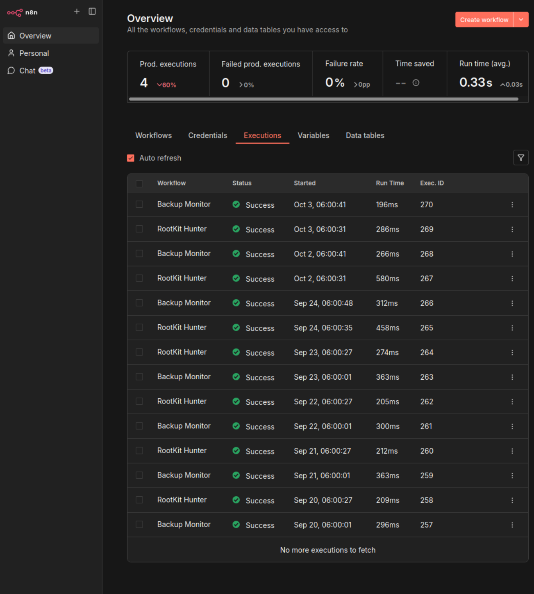

# Operations and Automation

Operations combine native scheduling, container administration, monitoring and
n8n workflows. n8n processes backup and security results, classifies status and
sends operational notifications.

## Automation Components

| Component | Role |
| --- | --- |
| cron | Schedule backup, verification and other operational work |
| n8n | Process operational results and classify status |
| Telegram integration | Deliver operational notifications |
| Unattended upgrades | Automate package update handling |
| systemd / Docker Compose | Manage host services and container projects |

## Notification Paths

| Input | Processing | Output |
| --- | --- | --- |
| Security scan/log results | n8n status classification | Telegram notification |
| Backup/verification results | n8n success, warning or failure classification | Telegram notification |

## Workflow Executions

*The execution history shows successful runs of “Backup Monitor” and “RootKit
Hunter” on multiple days, demonstrating n8n's infrastructure operations role.*

Workflow success records execution status, not the underlying backup's recovery
quality or confirmation of Telegram delivery.

## Scheduled Backup Operations

The daily backup runs at 04:00; verification follows at 05:00 in server-local
time. Verification includes temporary extraction and cleanup rather than
restoring services in place.

See [backup and recovery](backup-and-recovery.md) for destination, retention
and database-consistency boundaries.

## Troubleshooting Approach

The architecture provides a practical investigation path:

| Symptom | Relevant evidence to check |
| --- | --- |
| Service unavailable | Container/service state, logs, listener and proxy path |
| DNS or VPN connectivity failure | Service state, network membership, host rules and upstream routing |
| Missing metrics | Exporter status, scrape results and recent data |
| Backup warning/failure | Job result, destination mount state, archive checks and copy hashes |
| Missing notification | Source result, n8n execution status and notification delivery |

Container logs, host service logs and metrics are correlated before assigning a
cause. Routine maintenance also includes reviewing scheduled job results,
storage availability, package updates and pending reboots.
